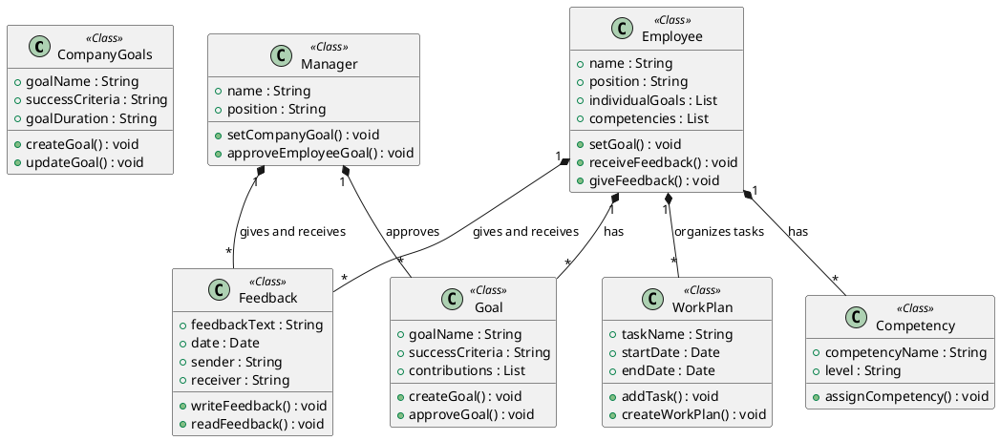

### Class Diagram

The class diagram above illustrates the relationships between the classes in the system. The `CompanyGoals` class represents the company's goals, which are created and updated by the `Employee` class. The `Manager` class sets company goals and approves employee goals. The `Goal` class represents individual goals set by employees, which are approved by managers. The `Competency` class represents the competencies of employees, which are assigned by the employees themselves. The `Feedback` class represents feedback given and received by employees and managers. The `WorkPlan` class represents the work schedule and tasks organized by employees.

### Class Definitions

-   `CompanyGoals`: Represents the company's goals, including the goal name, success criteria, and duration. It has methods to create and update goals.

-   `Employee`: Represents an employee, including their name, position, individual goals, and competencies. It has methods to set goals, receive feedback, and give feedback.

-   `Manager`: Represents a manager, including their name and position. It has methods to set company goals and approve employee goals.

-   `Goal`: Represents an individual goal set by an employee, including the goal name, success criteria, and contributions. It has methods to create and approve goals.

-   `Competency`: Represents the competencies of an employee, including the competency name and level. It has a method to assign competencies.

-   `Feedback`: Represents feedback given and received by employees and managers, including the feedback text, date, sender, and receiver. It has methods to write and read feedback.

-   `WorkPlan`: Represents the work schedule and tasks organized by employees, including the task name, start date, and end date. It has methods to add tasks and create work plans.

### Relationships

-   `Employee` has one or more `Goal`s, which represent the individual goals set by the employee.

-   `Manager` approves one or more `Goal`s set by employees.

-   `Manager` gives and receives feedback from one or more `Feedback` objects.

-   `Employee` gives and receives feedback from one or more `Feedback` objects.

-   `Employee` has one or more `Competency` objects, which represent the competencies of the employee.

-   `Employee` organizes tasks in one or more `WorkPlan` objects, which represent the work schedule and tasks.

The class diagram provides an overview of the system's structure and relationships between the main classes involved in the goal-setting and feedback process. It helps visualize how the classes interact and collaborate to achieve the system's functionality.
