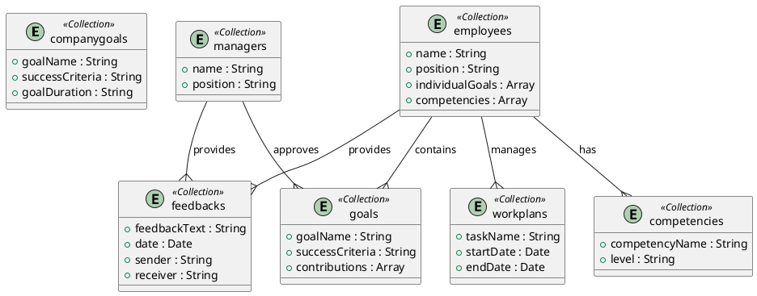

### Database Model

NoSQL databases are used to store and manage data in the system. The database model for the system is designed to store information about company goals, employees, managers, goals, competencies, feedback, and work plans. The database model consists of the following collections:

-   `companygoals`: Represents the company's goals, which are created and updated by the `employees` collection.
-   `employees`: Represents employees in the system, who have individual goals, competencies, and work plans.
-   `managers`: Represents managers in the system, who set company goals and approve employee goals.
-   `goals`: Represents individual goals set by employees, which are approved by managers.
-   `competencies`: Represents the competencies of employees, which are assigned by the employees themselves.
-   `feedbacks`: Represents feedback given and received by employees and managers.
-   `workplans`: Represents the work schedule and tasks organized by employees.

The relationships between the collections are as follows:

-   `employees` collection contains `goals` collection.
-   `managers` collection approves `goals` collection.
-   `managers` collection provides `feedbacks` collection.
-   `employees` collection provides `feedbacks` collection.
-   `employees` collection has `competencies` collection.
-   `employees` collection manages `workplans` collection.

The database model is designed to store and manage information about company goals, employee goals, competencies, feedback, and work plans in the system.
