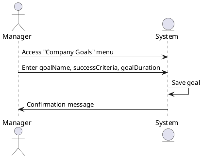

### Company Goal Creation Sequence Diagram

The manager accesses the company goals menu and defines periodic goals and success criteria. The system records the goals and makes them accessible. The system warns the manager if there is incomplete information and completes the goal definition.

### Actors

-   Manager
-   System
