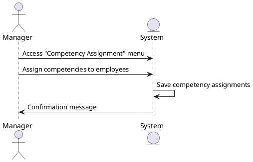

### Competency Assignment Sequence Diagram

The manager accesses the 'Competency Assignment' menu and assigns competencies to employees. The system saves the competency assignments and provides a confirmation message.

### Actors

-   Manager
