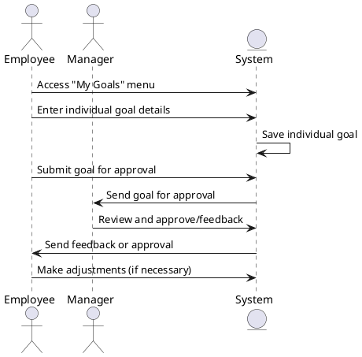

### Employee Goal Contribution Sequence Diagram

The employee accesses the 'My Goals' menu and sets individual contribution goals based on company objectives. The employee enters goal details and success criteria and sends the goals to the manager for approval. The manager reviews the goals and provides feedback. If the goals are not approved, the employee makes adjustments to the goals.

### Actors

-   Employee
-   Manager
-   System
