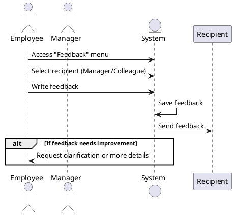

### Giving Employee Feedback Sequence Diagram

The employee accesses the feedback menu, selects the recipient (manager or colleague), writes the feedback, and sends it. The system saves the feedback and sends it to the recipient. If the feedback needs improvement, the system requests clarification or more details.

### Actors

-   Employee
-   Manager
-   Colleague
-   System
