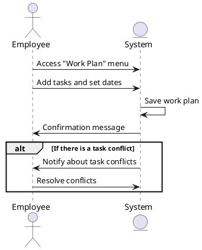

### Work Plan Creation Sequence Diagram

The employee accesses the 'Work Plan' menu, adds tasks, and sets dates. The system saves the work plan and provides a confirmation message. If there is a task conflict, the system notifies the employee about the conflicts, and the employee resolves them.

### Actors

-   Employee
-   System
