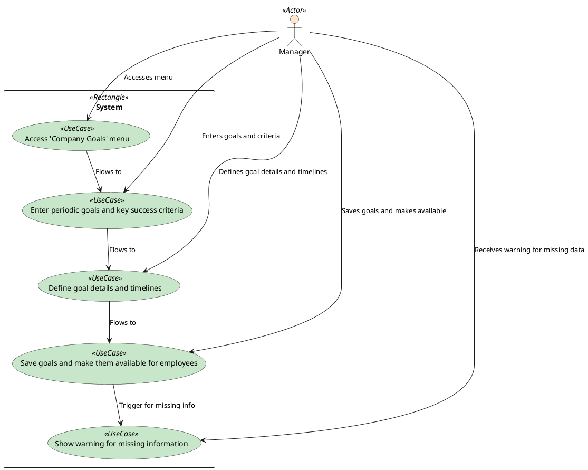

### Company Goal Creation

The manager accesses the company goals menu and defines periodic goals and success criteria. The manager also defines goal details and timeframes. The system records the goals and makes them accessible. The system warns the manager if there is incomplete information and completes the goal definition.

### Actors

-   Manager
-   System

### Pre-Conditions

-   The manager has access to the company goals menu.

### Post-Conditions

-   The system records the goals and makes them accessible.

### Normal Flow

1. The manager accesses the company goals menu.
2. The manager defines periodic goals and success criteria.
3. The manager defines goal details and timeframes.
4. The system records the goals and makes them accessible.

### Alternative Flows

-   The system warns the manager if there is incomplete information.
-   The system completes the goal definition.

### Exceptions

-   The system does not record the goals if the manager does not define them.
