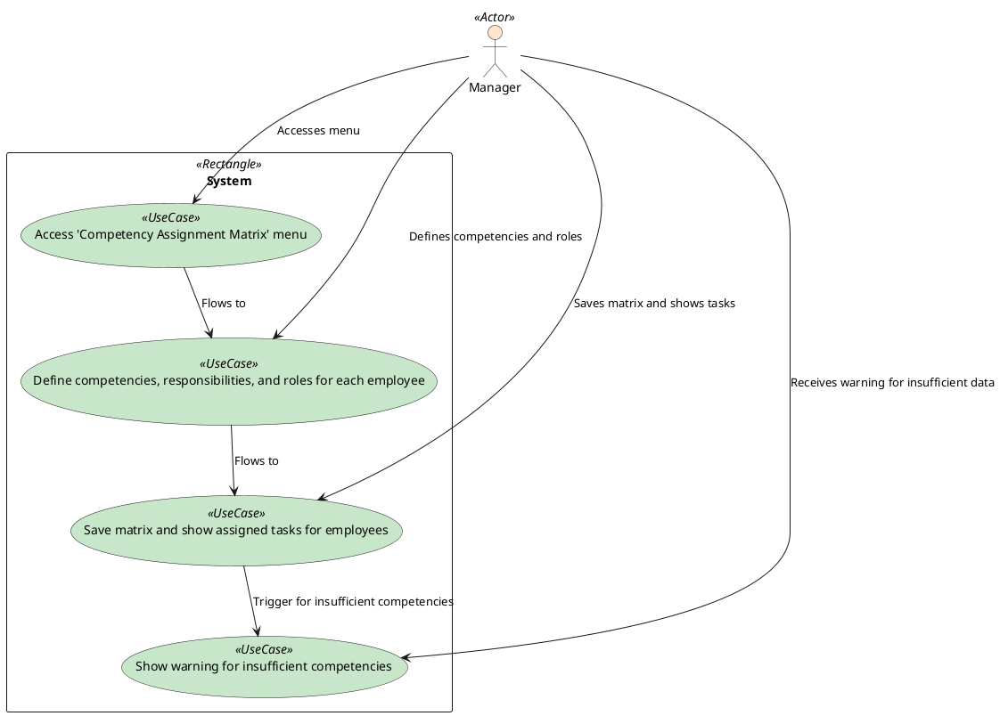

### Competency Assignment Matrix

The manager accesses the 'Competency Assignment Matrix' menu and defines competencies, responsibilities, and roles for each employee. The system saves the matrix and shows the assigned tasks for employees. The system warns the manager if there are insufficient competencies.

### Actors

-   Manager
-   System

### Pre-Conditions

-   The manager has access to the 'Competency Assignment Matrix' menu.

### Post-Conditions

-   The system saves the matrix and shows the assigned tasks for employees.

### Normal Flow

1. The manager accesses the 'Competency Assignment Matrix' menu.
2. The manager defines competencies, responsibilities, and roles for each employee.
3. The system saves the matrix and shows the assigned tasks for employees.

### Alternative Flows

-   The system warns the manager if there are insufficient competencies.

### Exceptions

-   The system does not save the matrix if the manager does not define competencies.
