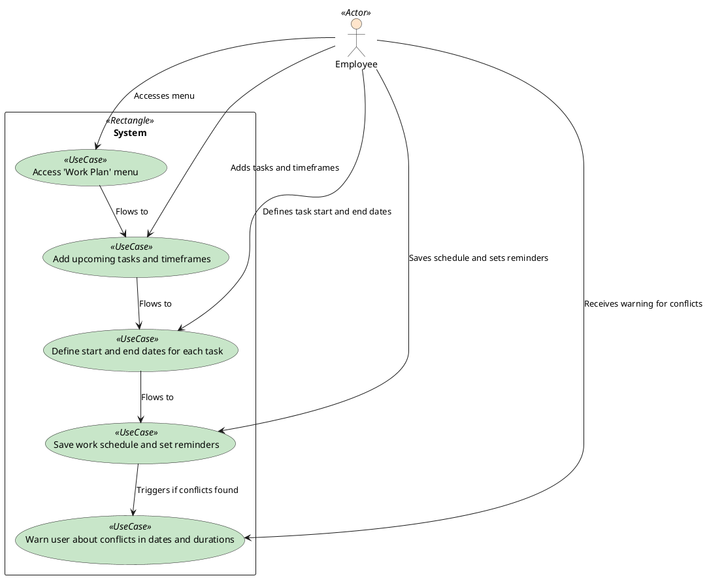

### Creating Work Schedule and Plan

The employee accesses the 'Work Plan' menu and adds upcoming tasks and timeframes. The employee defines the start and end dates for each task, saves the work schedule, and sets reminders. The system warns the user about conflicts in dates and durations.

### Actors

-   Employee
-   System

### Pre-Conditions

-   The employee has access to the 'Work Plan' menu.

### Post-Conditions

-   The system saves the work schedule and sets reminders.

### Normal Flow

1. The employee accesses the 'Work Plan' menu.
2. The employee adds upcoming tasks and timeframes.
3. The employee defines the start and end dates for each task.
4. The employee saves the work schedule and sets reminders.

### Alternative Flows

-   The system warns the user about conflicts in dates and durations.

### Exceptions

-   The system does not save the work schedule if the user does not define tasks.
