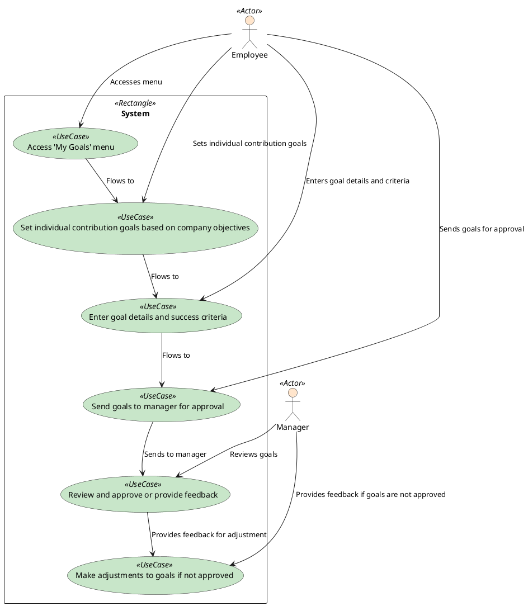

### Employee Contribution to Goal

The employee accesses the 'My Goals' menu and sets individual contribution goals based on company objectives. The employee enters goal details and success criteria and sends the goals to the manager for approval. The manager reviews the goals and provides feedback. If the goals are not approved, the employee makes adjustments to the goals.

### Actors

-   Employee
-   Manager
-   System

### Pre-Conditions

-   The employee has access to the 'My Goals' menu.

### Post-Conditions

-   The manager reviews the goals and provides feedback.

### Normal Flow

1. The employee accesses the 'My Goals' menu.
2. The employee sets individual contribution goals based on company objectives.
3. The employee enters goal details and success criteria.
4. The employee sends the goals to the manager for approval.
5. The manager reviews the goals and provides feedback.

### Alternative Flows

-   The employee makes adjustments to the goals if they are not approved.

### Exceptions

-   The manager does not approve the goals if they do not meet the company objectives.
