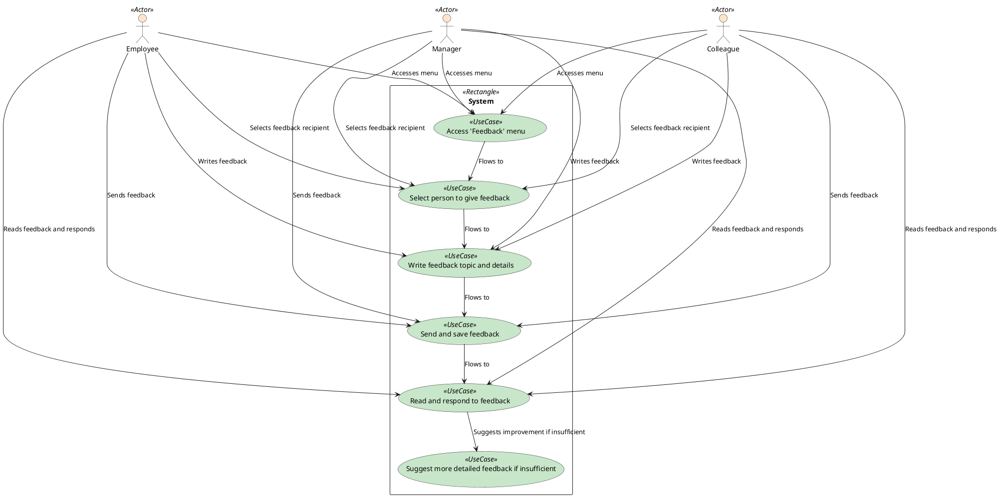

### Receiving Employee Feedback

The employee, manager, and colleague access the feedback menu. They select the person to give feedback, write the feedback topic and details, and send and save the feedback. The recipient reads the feedback and responds. If the feedback is insufficient, the recipient suggests more detailed feedback.

### Actors

-   Employee
-   Manager
-   Colleague
-   System

### Pre-Conditions

-   The employee, manager, and colleague have access to the feedback menu.

### Post-Conditions

-   The recipient reads the feedback and responds.

### Normal Flow

1. The employee, manager, or colleague accesses the feedback menu.
2. The employee, manager, or colleague selects the person to give feedback.
3. The employee, manager, or colleague writes the feedback topic and details.
4. The employee, manager, or colleague sends the feedback.
5. The recipient reads the feedback and responds.

### Alternative Flows

-   The recipient suggests more detailed feedback if the feedback is insufficient.

### Exceptions

-   The recipient does not respond to the feedback if it is incomplete.
